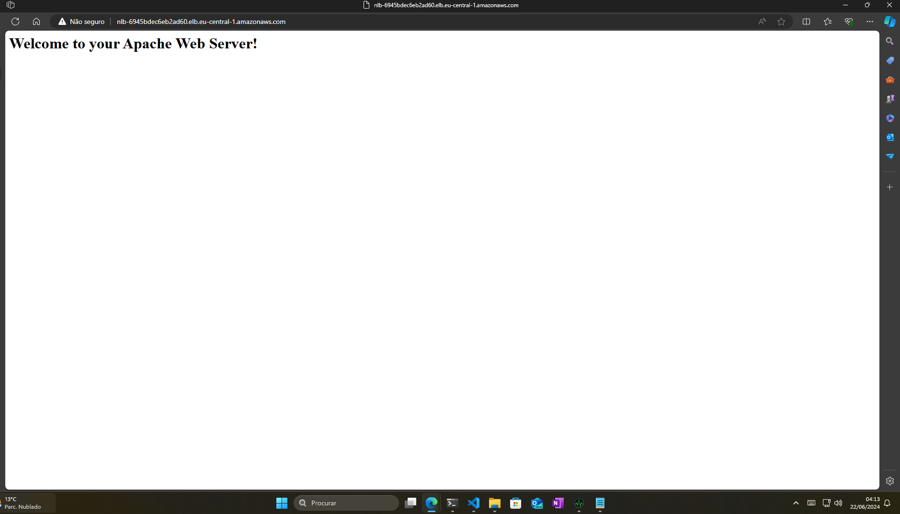
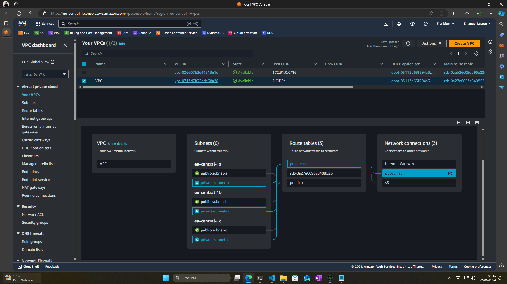
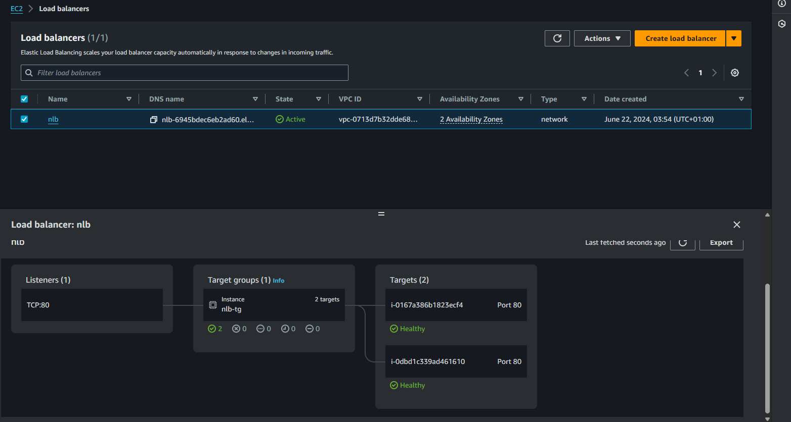

# The Real DevOps Challenge

This challenge was designed to look for your DevOps skills with some tasks that we could find in our day in day. You have to fork this repository to complete the following challenges in your own Github account. Feel free to solve the challenge you want.

Once completed, upload all files to reproduce the challenges and if you think is necessary create `SOLUTION.md` file to add some explanation in each challenge directory.

In each challenge you can reach some tasks, some are mandatory and others optionals. If you want to do it and prove your knowledge, go for the optional ones! ;). If you have any doubt, don't hesitate to open an issue to ask any question about any challenge.

## Pre-requisites

- GitHub account: <https://github.com/signup>
- IaC Test account (choose one):
  - AWS Free Tier account: <https://aws.amazon.com/free/>
  - Localstack API: <https://localstack.cloud>
- Docker Hub account: <https://hub.docker.com>
- `Docker`: <https://www.docker.com>
- `Terraform`: <https://www.terraform.io>
- Kubernetes (choose one):
  - `KinD`: <https://kind.sigs.k8s.io>
  - `Minikube`: <https://minikube.sigs.k8s.io/docs/start/>
  - `k3s`: <https://k3s.io>

## First step!

Clone repository

```bash
git clone https://github.com/intelygenz/the-real-devops-challenge.git
```

## Challenge 1. Docker and CI/CD

> Estimated time: 30 minutes

Now, show us your skills with Python (or whatever language you are most comfortable with) to develop a webserver (using `HTTPServer` python library) which listens on port `8000`. When you make a request to the server, it will return the following information:


Once you have it finished, can you create a Dockerfile and build an image with your application?

Helpers:

- [HTTPServer library](https://docs.python.org/3/library/http.server.html)
- [Dockerfile instructions](https://docs.docker.com/develop/develop-images/instructions/)

Optional:

- Application accepts arguments. Example: `--host`, `--port`
- Securize your Dockerfile
- Allow pass arguments when executing `docker run`. For example: `docker run <your-image-tag> --port 8081`
- Pass coverage with `dive` ([wagoodman/dive](https://github.com/wagoodman/dive)). Use `.dive-ci` that is provided in the repository

```bash
# command
CI=true dive <your-image-tag>

# result
Result:PASS [Total:3] [Passed:3] [Failed:0] [Warn:0] [Skipped:0]
```

- Upload your image to Docker Hub account with Github Actions ([docker/build-push-action](https://github.com/docker/build-push-action))

## Challenge 2. Kubernetes

> Estimated time: 45 minutes

Finally, deploy your Challenge 1 application on Kubernetes. Can you develop a Helm chart and deploy your image? The application will be exposed with an Ingress (choose the one you want: Nginx, Traefik…).

> Note: if you couldn’t complete Challenge 1, you can use the latest version of the `httpd` image on Helm chart.

Helpers:

- Helm best practices: <https://helm.sh/docs/chart_best_practices>
- NIP.io: <https://nip.io>
- Kubernetes:
  - `KinD`: <https://kind.sigs.k8s.io>
  - `Minikube`: <https://minikube.sigs.k8s.io/docs/start/>
  - `k3s`: <https://k3s.io>
- Ingress Controller: [services-networking/ingress-controllers/](https://kubernetes.io/docs/concepts/services-networking/ingress-controllers/)

Optional:

- Generate documentation for Helm chart ([norwoodj/helm-docs](https://github.com/norwoodj/helm-docs))
- Test end-to-end Helm chart with Github Action: [helm/chart-testing-action](https://github.com/helm/chart-testing-action)
- Validate `values.yaml` with `values.schema.json`

## Challenge 3. Infrastructure as a Code

> Estimated time: 2 hours

We’ve a infrastructure diagram, can you develop Terraform manifests? To check everything works properly, add `user_data` to install `httpd` (default config) and start service.

Maybe read helpers section can you give you how-to start the challenge and organize files. Create `challenge-3` folder to store all files.


When you finish, you can reach Load Balancer a get the following output:


Helpers:

- IaC Test account:
  - AWS Free Tier account: <https://aws.amazon.com/free/>
  - Localstack API: <https://localstack.cloud>
- Terraform best practices: <https://cloud.google.com/docs/terraform/best-practices-for-terraform>
- Terraform AWS provider: <https://registry.terraform.io/providers/hashicorp/aws/latest>
- Terraform AWS modules:
  - Load Balancer: <https://registry.terraform.io/modules/terraform-aws-modules/alb/aws/latest>
  - S3: <https://registry.terraform.io/modules/terraform-aws-modules/s3-bucket/aws/latest>
  - RDS cluster: <https://registry.terraform.io/modules/terraform-aws-modules/rds-aurora/aws/latest>
  - VPC: <https://registry.terraform.io/modules/terraform-aws-modules/vpc/aws/latest>
  - Auto Scaling groups: <https://registry.terraform.io/modules/terraform-aws-modules/autoscaling/aws/latest>

Optional:

- Generate documentation for Terraform code (we provide `.terraform-docs.yaml` file): <https://github.com/terraform-docs/terraform-docs>
- Pass Terraform syntax checker and linters (we provide `.tflint.hcl` and `.tfsec.yaml` files):
  - `validate`: <https://developer.hashicorp.com/terraform/cli/commands/validate>
  - `fmt`: <https://developer.hashicorp.com/terraform/cli/commands/fmt>
  - `tflint`: <https://github.com/terraform-linters/tflint>
  - `tfsec`: <https://github.com/aquasecurity/tfsec> (save output, don't fix it!!)
- Create Terraform syntax checker and linters with GitHub Actions

<!-- BEGIN_TF_DOCS -->
## Requirements

| Name | Version |
|------|---------|
| <a name="requirement_terraform"></a> [terraform](#requirement_terraform) | >=1.0.0 |

## Providers

No providers.

## Modules

| Name | Source | Version |
|------|--------|---------|
| <a name="module_asg"></a> [asg](#module_asg) | ./aws-modules/asg | n/a |
| <a name="module_nlb"></a> [nlb](#module_nlb) | ./aws-modules/nlb | n/a |
| <a name="module_rds"></a> [rds](#module_rds) | ./aws-modules/rds | n/a |
| <a name="module_s3_assets"></a> [s3_assets](#module_s3_assets) | ./aws-modules/s3 | n/a |
| <a name="module_vpc"></a> [vpc](#module_vpc) | ./aws-modules/vpc | n/a |

## Resources

No resources.

## Inputs

| Name | Description | Type | Default | Required |
|------|-------------|------|---------|:--------:|
| <a name="input_asg_name"></a> [asg_name](#input_asg_name) | the name of the autoscaling group | `string` | n/a | yes |
| <a name="input_bucket_name"></a> [bucket_name](#input_bucket_name) | Name of the bucket | `string` | n/a | yes |
| <a name="input_cidrs"></a> [cidrs](#input_cidrs) | CIDRs of the VPC | <pre>object({<br>    primary   = string<br>    secondary = optional(list(string))<br>  })</pre> | n/a | yes |
| <a name="input_log_bucket_name"></a> [log_bucket_name](#input_log_bucket_name) | Name of the log bucket | `string` | n/a | yes |
| <a name="input_subnets"></a> [subnets](#input_subnets) | n/a | <pre>map(object({<br>    availability_zones = optional(list(string), ["a", "b", "c"])<br>    cidr_block         = string<br>    IsPrivate          = bool<br>    Isroutable         = bool<br>    subnetName         = optional(string, "")<br>  }))</pre> | n/a | yes |
| <a name="input_target_groups"></a> [target_groups](#input_target_groups) | n/a | <pre>map(object({<br>    name            = optional(string, "nlb-tg")<br>    port            = optional(number, 80)<br>    target_type     = optional(string, "instance")<br>    protocol        = optional(string, "TCP")<br>    health_protocol = optional(string, "TCP")<br>  }))</pre> | n/a | yes |
| <a name="input_region"></a> [region](#input_region) | region to deploy the subnetes | `string` | `"eu-central-1"` | no |

## Outputs

No outputs.
<!-- END_TF_DOCS -->

Browse for NLB DNS


Network Map


Network Load Balancer Target groups 


## Final considerations
- NLB was only present in eu-central-1a and eu-central-1b
- ASG spans instance accross all the azs.
- Instances outside of the NLB reach, won't be target.